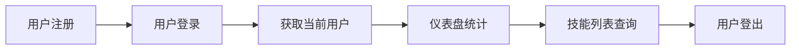

# 灵思·AI学伴 - 接口测试完整指南

> 版本：v2.0 | 适用对象：测试人员 | 最后更新：2026-06-24

---

## 一、文档概述

本文档覆盖灵思·AI学伴项目所有 **后端 API 接口** 及 **外部 AI 服务接口**，用于指导测试人员进行全面的接口测试。

### 1.1 测试环境

| 项目 | 值 |
|------|-----|
| 后端服务地址 | `http://localhost:8080` |
| 管理后台地址 | `http://localhost:5173` |
| Dify AI 服务 | `http://localhost:9000`（可选） |
| API 前缀 | `/api` |
| 统一响应格式 | `{ code, message, data }` |
| 认证方式 | JWT Bearer Token |

### 1.2 统一响应结构

```json
// 成功响应
{ "code": 200, "message": "操作成功", "data": { ... } }

// 失败响应
{ "code": 400, "message": "参数错误", "data": null }
{ "code": 401, "message": "未登录或Token已过期", "data": null }
{ "code": 403, "message": "无权限", "data": null }
{ "code": 500, "message": "服务器内部错误", "data": null }
```

### 1.3 分页响应结构

```json
{
  "code": 200,
  "message": "操作成功",
  "data": {
    "total": 100,
    "current": 1,
    "size": 10,
    "records": [ ... ]
  }
}
```

---

## 二、认证管理接口（Auth）

### 2.1 用户注册

- **URL：** `POST /api/auth/register`
- **鉴权：** ❌ 无需
- **请求体：**
  ```json
  {
    "username": "testuser",       // 必填，3-20个字符
    "password": "123456",         // 必填，6-30个字符
    "nickname": "测试用户",       // 选填
    "email": "test@example.com",  // 选填，邮箱格式
    "phone": "13800138000"        // 选填，11位手机号
  }
  ```
- **成功响应：** `{ code: 200, message: "注册成功", data: { id, username, nickname, email, phone, avatar, role, status, createTime } }`
- **测试用例：** 正常注册 / 重复用户名 / 空必填字段 / 密码过短 / 邮箱格式错误

### 2.2 用户登录

- **URL：** `POST /api/auth/login`
- **鉴权：** ❌ 无需
- **请求体：**
  ```json
  { "username": "testuser", "password": "123456" }
  ```
- **成功响应：**
  ```json
  {
    "code": 200,
    "message": "登录成功",
    "data": {
      "token": "eyJhbGciOiJIUzI1NiJ9...",
      "user": { "id": 1, "username": "testuser", "nickname": "测试用户", "email": "test@example.com", "phone": "13800138000", "avatar": null, "role": "user", "status": 1, "createTime": "2026-06-24T10:00:00" }
    }
  }
  ```
- **测试用例：** 正确账号密码 / 错误密码 / 不存在的用户 / 空字段

### 2.3 管理员登录

- **URL：** `POST /api/auth/admin/login`
- **鉴权：** ❌ 无需
- **请求体/响应：** 同 2.2 用户登录

### 2.4 用户登出

- **URL：** `POST /api/auth/logout`
- **鉴权：** ✅ 需要 Token
- **响应：** `{ code: 200, message: "登出成功", data: null }`

---

## 三、管理员认证接口（Admin）

### 3.1 管理员登录

- **URL：** `POST /api/admin/login`
- **鉴权：** ❌ 无需
- **说明：** 与 `/api/auth/login` 功能一致，专为管理后台提供

### 3.2 获取管理员信息

- **URL：** `GET /api/admin/info`
- **鉴权：** ✅ 需要 Token
- **响应：** `{ code: 200, message: "操作成功", data: { id, username, nickname, email, phone, avatar, role, status, createTime } }`

---

## 四、用户管理接口（User）

### 4.1 获取当前登录用户信息

- **URL：** `GET /api/users/me`
- **鉴权：** ✅ 需要 Token
- **响应：** 返回当前登录用户的 `UserVO` 对象

### 4.2 修改当前用户密码

- **URL：** `PUT /api/users/me/password`
- **鉴权：** ✅ 需要 Token
- **请求体：**
  ```json
  { "oldPassword": "123456", "newPassword": "654321" }
  ```
- **测试用例：** 正确旧密码 / 旧密码错误 / 新密码过短

### 4.3 获取指定用户信息

- **URL：** `GET /api/users/{id}`
- **鉴权：** ✅ 需要 Token
- **路径参数：** `id` (Long) - 用户ID
- **测试用例：** 存在的用户 / 不存在的用户 / 非数字ID

### 4.4 更新用户信息

- **URL：** `PUT /api/users/{id}`
- **鉴权：** ✅ 需要 Token
- **请求体：**
  ```json
  { "nickname": "新昵称", "email": "new@test.com", "phone": "13900139000" }
  ```
- **测试用例：** 更新自己资料 / 更新他人资料（权限） / 邮箱格式错误

### 4.5 分页查询用户列表

- **URL：** `GET /api/users` 或 `GET /api/users/list`
- **鉴权：** ✅ 需要 Token
- **查询参数：**
  | 参数 | 类型 | 默认值 | 说明 |
  |------|------|--------|------|
  | current | int | 1 | 当前页码 |
  | size | int | 10 | 每页条数 |
  | keyword | string | - | 搜索用户名/昵称 |

### 4.6 删除用户

- **URL：** `DELETE /api/users/{id}`
- **鉴权：** ✅ 需要 Token
- **路径参数：** `id` (Long)

---

## 五、技能管理接口（Skill）

### 5.1 新增技能

- **URL：** `POST /api/skills`
- **鉴权：** ✅ 需要 Token
- **请求体：**
  ```json
  {
    "name": "Java基础",       // 必填
    "category": "后端开发",   // 必填
    "description": "Java语言基础语法和面向对象编程",
    "level": 1               // 1-5，对应入门到专家
  }
  ```

### 5.2 更新技能

- **URL：** `PUT /api/skills/{id}`
- **鉴权：** ✅ 需要 Token

### 5.3 删除技能

- **URL：** `DELETE /api/skills/{id}`
- **鉴权：** ✅ 需要 Token

### 5.4 获取技能详情

- **URL：** `GET /api/skills/{id}`
- **鉴权：** ✅ 需要 Token

### 5.5 分页查询技能列表

- **URL：** `GET /api/skills`
- **鉴权：** ✅ 需要 Token
- **查询参数：** current, size, keyword

### 5.6 获取技能树（全量）

- **URL：** `GET /api/skills/tree`
- **鉴权：** ✅ 需要 Token
- **查询参数：** category（选填，按分类筛选）
- **响应：** 返回技能列表，前端按 category 分组转为树形结构

### 技能等级说明
| 等级值 | 标签 | 说明 |
|--------|------|------|
| 1 | 入门 | 基础概念和简单使用 |
| 2 | 基础 | 能独立完成基础开发 |
| 3 | 进阶 | 掌握核心原理 |
| 4 | 高级 | 能解决复杂问题 |
| 5 | 专家 | 深入原理、性能优化 |

### Mock 测试数据（12条记录）
涵盖分类：`前端开发` / `后端开发` / `数据库` / `运维部署` / `架构设计` / `工具`

---

## 六、学习记录管理接口（StudyRecord）

### 6.1 新增学习记录

- **URL：** `POST /api/study-records`
- **鉴权：** ✅ 需要 Token
- **请求体：**
  ```json
  {
    "userId": 1,
    "content": "学习了Java基础语法",
    "duration": 60,
    "type": "practice"
  }
  ```
- **学习类型枚举：** `reading`（阅读）/ `practice`（练习）/ `video`（视频）/ `quiz`（测验）/ `coding`（编程）/ `discussion`（讨论）

### 6.2 更新学习记录

- **URL：** `PUT /api/study-records/{id}`
- **鉴权：** ✅ 需要 Token

### 6.3 删除学习记录

- **URL：** `DELETE /api/study-records/{id}`
- **鉴权：** ✅ 需要 Token

### 6.4 获取学习记录详情

- **URL：** `GET /api/study-records/{id}`
- **鉴权：** ✅ 需要 Token

### 6.5 分页查询学习记录

- **URL：** `GET /api/study-records/list`
- **鉴权：** ✅ 需要 Token
- **查询参数：**
  | 参数 | 类型 | 默认值 | 说明 |
  |------|------|--------|------|
  | current | int | 1 | 当前页码 |
  | size | int | 10 | 每页条数 |
  | userId | Long | - | 选填，按用户筛选 |

### Mock 测试数据（12条记录）
涵盖不同用户（张三~黄十四）和不同学习类型（JavaScript、Vue3、Python、Spring Boot 等）

---

## 七、简历评估管理接口（Resume）

### 7.1 创建简历评估

- **URL：** `POST /api/resumes`
- **鉴权：** ✅ 需要 Token
- **请求体：**
  ```json
  {
    "userId": 1,
    "title": "Java后端开发简历",
    "content": "简历文本内容...",
    "evaluation": "评估结果文本...",
    "score": 85,
    "strengths": "1. 项目经验丰富\n2. 技术栈全面",
    "suggestions": "1. 增加开源项目\n2. 补充系统设计经验",
    "status": "completed"
  }
  ```
- **状态枚举：** `pending`（待评估）/ `evaluating`（评估中）/ `completed`（已完成）/ `failed`（评估失败）

### 7.2 更新简历评估

- **URL：** `PUT /api/resumes/{id}`
- **鉴权：** ✅ 需要 Token

### 7.3 删除简历评估

- **URL：** `DELETE /api/resumes/{id}`
- **鉴权：** ✅ 需要 Token

### 7.4 获取简历评估详情

- **URL：** `GET /api/resumes/{id}`
- **鉴权：** ✅ 需要 Token

### 7.5 获取用户的所有简历评估

- **URL：** `GET /api/resumes/user/{userId}`
- **鉴权：** ✅ 需要 Token

### 7.6 分页查询简历评估

- **URL：** `GET /api/resumes/list`
- **鉴权：** ✅ 需要 Token
- **查询参数：** current, size, userId

---

## 八、订单管理接口（Order）

### 8.1 新增订单

- **URL：** `POST /api/orders`
- **鉴权：** ✅ 需要 Token
- **请求体：**
  ```json
  {
    "userId": 1,
    "product": "灵思·AI学伴季卡",
    "amount": 299,
    "status": "pending"
  }
  ```

### 8.2 更新订单

- **URL：** `PUT /api/orders/{id}`
- **鉴权：** ✅ 需要 Token

### 8.3 删除订单

- **URL：** `DELETE /api/orders/{id}`
- **鉴权：** ✅ 需要 Token

### 8.4 获取订单详情

- **URL：** `GET /api/orders/{id}`
- **鉴权：** ✅ 需要 Token

### 8.5 分页查询订单列表

- **URL：** `GET /api/orders`
- **鉴权：** ✅ 需要 Token
- **查询参数：**
  | 参数 | 类型 | 默认值 | 说明 |
  |------|------|--------|------|
  | current | int | 1 | 当前页码 |
  | size | int | 10 | 每页条数 |
  | keyword | string | - | 搜索订单号/用户 |
  | status | string | - | 筛选：pending/paid/completed/cancelled |

### 订单状态枚举
| 值 | 标签 | 说明 |
|----|------|------|
| pending | 待支付 | 等待用户支付 |
| paid | 已支付 | 支付完成 |
| completed | 已完成 | 订单完成 |
| cancelled | 已取消 | 订单取消 |

### Mock 测试数据（5条记录）
| ID | 用户 | 产品 | 金额 | 状态 |
|----|------|------|------|------|
| 1001 | 张三 | 灵思·AI学伴季卡 | ¥299 | paid |
| 1002 | 李四 | 灵思·AI学伴月卡 | ¥99 | pending |
| 1003 | 王五 | VIP年卡 | ¥999 | completed |
| 1004 | 赵六 | 灵思·AI学伴季卡 | ¥299 | cancelled |
| 1005 | 钱七 | 灵思·AI学伴月卡 | ¥99 | paid |

---

## 九、AI配置管理接口（AIConfig）

### 9.1 新增AI配置

- **URL：** `POST /api/ai/configs`
- **鉴权：** ✅ 需要 Token
- **请求体：**
  ```json
  {
    "name": "Dify智能问答",
    "apiKey": "app-xxxxxxxx",
    "endpoint": "http://localhost:9000/v1",
    "model": "gpt-4",
    "enabled": true,
    "config": {}
  }
  ```

### 9.2 更新AI配置

- **URL：** `PUT /api/ai/configs/{id}`
- **鉴权：** ✅ 需要 Token

### 9.3 删除AI配置

- **URL：** `DELETE /api/ai/configs/{id}`
- **鉴权：** ✅ 需要 Token

### 9.4 获取AI配置详情

- **URL：** `GET /api/ai/configs/{id}`
- **鉴权：** ✅ 需要 Token

### 9.5 分页查询AI配置列表

- **URL：** `GET /api/ai/configs`
- **鉴权：** ✅ 需要 Token
- **查询参数：** current, size, keyword

### 9.6 获取AI统计信息

- **URL：** `GET /api/ai/configs/stats` 或 `GET /api/ai/stats`
- **鉴权：** ✅ 需要 Token
- **响应示例：**
  ```json
  {
    "code": 200,
    "message": "操作成功",
    "data": {
      "totalRequests": 12580,
      "successRate": 98.5,
      "avgResponseTime": 320,
      "todayRequests": 285
    }
  }
  ```

---

## 十、仪表盘接口（Dashboard）

### 10.1 获取仪表盘统计数据

- **URL：** `GET /api/dashboard/stats`
- **鉴权：** ✅ 需要 Token
- **响应示例：**
  ```json
  {
    "code": 200,
    "message": "操作成功",
    "data": {
      "totalUsers": 1250,
      "totalLearningHours": 1280,
      "aiInteractions": 3560,
      "activeUsers": 860
    }
  }
  ```

### 10.2 获取用户增长数据（前端预留接口）

- **URL：** `GET /api/dashboard/user-growth`
- **鉴权：** ✅ 需要 Token
- **说明：** 当前为预留接口，未完全实现，前端使用 Mock 数据兜底

### 10.3 获取学习统计（前端预留接口）

- **URL：** `GET /api/dashboard/learning-stats`
- **鉴权：** ✅ 需要 Token
- **说明：** 当前为预留接口，未完全实现，前端使用 Mock 数据兜底

---

## 十一、移动端专用接口

以下接口通过移动端 `HttpClient` 封装类调用，与后端 REST API 一致，统一通过 `Constants.BASE_URL`（`http://10.0.2.2:8080`）访问。

| 接口 | HTTP方法 | 说明 |
|------|---------|------|
| `/api/auth/admin/login` | POST | 移动端登录 |
| `/api/auth/register` | POST | 移动端注册 |
| `/api/users/me` | GET | 获取当前用户信息 |
| `/api/users/{id}` | PUT | 编辑个人资料 |
| `/api/users/me/password` | PUT | 修改密码 |
| `/api/skills/tree` | GET | 获取技能树 |
| `/api/study-records/list` | GET | 学习记录列表 |
| `/api/study-records` | POST | 新增学习记录 |
| `/api/resumes` | POST | 创建简历评估 |
| `/api/resumes/user/{userId}` | GET | 获取我的简历评估 |
| `/api/resumes/{id}` | GET | 获取评估详情 |
| `/api/resumes/{id}` | DELETE | 删除评估记录 |
| `/api/dashboard/stats` | GET | 首页统计数据 |

---

## 十二、外部服务接口 - Dify AI 平台

### 12.1 AI 智能聊天

- **服务地址：** `DifyApi.ets` 中配置
- **URL：** `POST {BASE_URL}/chat-messages`
- **鉴权：** API Key (Bearer Token)
- **请求体：**
  ```json
  {
    "query": "你好，请介绍一下你自己",
    "conversation_id": "",
    "response_mode": "blocking",
    "user": "student-001",
    "inputs": {}
  }
  ```
- **响应：**
  ```json
  {
    "answer": "你好！我是AI助手...",
    "conversation_id": "abc-xxx-xxx",
    "message_id": "msg-xxx",
    "created_at": 1234567890
  }
  ```
- **功能：** 多轮对话（通过 conversation_id 维持上下文）、Markdown 渲染、深度思考过程展示（可折叠）
- **测试要点：** 首次对话 / 多轮对话上下文连续 / 空消息 / 超长消息 / 快速连续发送 / API Key 错误 / 服务不可达

### 12.2 简历评估

- **服务地址：** `ResumeDifyApi.ets` 中配置
- **URL：** `POST {BASE_URL}/chat-messages`（使用独立的 Dify App）
- **鉴权：** 独立 API Key
- **请求体：**
  ```json
  {
    "query": "简历文本内容...",
    "response_mode": "blocking",
    "user": "app-user",
    "inputs": {}
  }
  ```
- **响应解析结构（Dify 返回的 `answer` 中为 JSON）：**
  ```json
  {
    "score": 85,
    "summary": "整体评价...",
    "strengths": ["项目经验丰富", "技术栈全面"],
    "weaknesses": ["缺乏分布式经验"],
    "suggestions": ["增加微服务项目", "补充性能优化经验"],
    "improvedVersion": "优化后的简历..."
  }
  ```
- **测试要点：** 完整简历评估 / 空内容 / 内容过短 / 评估失败处理

---

## 十三、完整接口速查表

### 13.1 无需鉴权接口

| 方法 | 路径 | 说明 |
|------|------|------|
| POST | `/api/auth/register` | 用户注册 |
| POST | `/api/auth/login` | 用户登录 |
| POST | `/api/auth/admin/login` | 管理员登录 |
| POST | `/api/admin/login` | 管理后台登录 |

### 13.2 需要鉴权接口（需携带 Bearer Token）

| 方法 | 路径 | 说明 |
|------|------|------|
| POST | `/api/auth/logout` | 用户登出 |
| GET | `/api/admin/info` | 获取管理员信息 |
| GET | `/api/users/me` | 获取当前用户信息 |
| PUT | `/api/users/me/password` | 修改密码 |
| GET | `/api/users/{id}` | 获取用户信息 |
| PUT | `/api/users/{id}` | 更新用户信息 |
| GET | `/api/users` | 用户列表（分页） |
| GET | `/api/users/list` | 用户列表（兼容） |
| DELETE | `/api/users/{id}` | 删除用户 |
| POST | `/api/skills` | 新增技能 |
| PUT | `/api/skills/{id}` | 更新技能 |
| DELETE | `/api/skills/{id}` | 删除技能 |
| GET | `/api/skills/{id}` | 技能详情 |
| GET | `/api/skills` | 技能列表（分页） |
| GET | `/api/skills/tree` | 技能树（全量） |
| POST | `/api/study-records` | 新增学习记录 |
| PUT | `/api/study-records/{id}` | 更新学习记录 |
| DELETE | `/api/study-records/{id}` | 删除学习记录 |
| GET | `/api/study-records/{id}` | 学习记录详情 |
| GET | `/api/study-records/list` | 学习记录列表（分页） |
| POST | `/api/resumes` | 创建简历评估 |
| PUT | `/api/resumes/{id}` | 更新简历评估 |
| DELETE | `/api/resumes/{id}` | 删除简历评估 |
| GET | `/api/resumes/{id}` | 简历评估详情 |
| GET | `/api/resumes/user/{userId}` | 用户的简历列表 |
| GET | `/api/resumes/list` | 简历评估列表（分页） |
| POST | `/api/orders` | 新增订单 |
| PUT | `/api/orders/{id}` | 更新订单 |
| DELETE | `/api/orders/{id}` | 删除订单 |
| GET | `/api/orders/{id}` | 订单详情 |
| GET | `/api/orders` | 订单列表（分页） |
| POST | `/api/ai/configs` | 新增AI配置 |
| PUT | `/api/ai/configs/{id}` | 更新AI配置 |
| DELETE | `/api/ai/configs/{id}` | 删除AI配置 |
| GET | `/api/ai/configs/{id}` | AI配置详情 |
| GET | `/api/ai/configs` | AI配置列表（分页） |
| GET | `/api/ai/configs/stats` | AI统计信息 |
| GET | `/api/ai/stats` | AI统计（兼容） |
| GET | `/api/dashboard/stats` | 仪表盘统计 |
| GET | `/api/dashboard/user-growth` | 用户增长（预留） |
| GET | `/api/dashboard/learning-stats` | 学习统计（预留） |

### 13.3 外部 AI 服务接口

| 服务 | 接入位置 | 用途 | 鉴权方式 |
|------|---------|------|---------|
| Dify Chat | `DifyApi.ets` | AI智能对话 | Dify API Key |
| Dify Resume | `ResumeDifyApi.ets` | 简历AI评估 | Dify API Key（独立App） |

---

## 十四、测试数据清单

### 14.1 用户测试数据

| 场景 | 用户名 | 密码 | 预期结果 |
|------|--------|------|---------|
| 正常注册 | `test_001` | `123456` | 注册成功 |
| 重复用户名 | `test_001` | `123456` | 返回错误提示 |
| 空用户名 | `` | `123456` | 400参数校验失败 |
| 密码过短 | `test_002` | `123` | 400参数校验失败 |
| 正常登录 | `test_001` | `123456` | 返回Token |
| 错误密码 | `test_001` | `wrong` | 401认证失败 |
| 不存在的用户 | `not_exist` | `123456` | 401认证失败 |

### 14.2 管理后台 Mock 管理员

| 账号 | 密码 | 说明 |
|------|------|------|
| admin | admin123 | 预设管理员（需数据库支持） |
| 任意用户 | - | 前端支持 Mock 模式直接登录 |

### 14.3 技能 Mock 数据分类

| 分类 | 技能数 | 技能名称 |
|------|--------|---------|
| 前端开发 | 3 | JavaScript基础 / Vue3框架 / TypeScript / React框架 |
| 后端开发 | 2 | Python基础 / Spring Boot |
| 数据库 | 2 | MySQL数据库 / Redis缓存 |
| 运维部署 | 2 | Docker容器 / Linux运维 |
| 架构设计 | 1 | 微服务架构 |
| 工具 | 1 | Git版本控制 |

---

## 十五、测试建议流程

### 15.1 冒烟测试（按顺序执行）



### 15.2 分模块完整测试

1. **认证模块：** 注册 → 登录 → 登出 → 重复注册 → 错误登录
2. **用户模块：** 获取信息 → 修改密码 → 更新资料 → 列表查询 → 删除
3. **技能模块：** 新增 → 详情 → 更新 → 分页查询 → 树形查询 → 删除
4. **学习记录：** 新增 → 详情 → 更新 → 分页查询 → 删除
5. **简历评估：** 创建 → 详情 → 更新 → 按用户查询 → 分页 → 删除
6. **订单模块：** 新增 → 详情 → 更新 → 状态筛选 → 搜索 → 删除
7. **AI配置：** 新增 → 详情 → 更新 → 列表 → 统计 → 删除
8. **仪表盘：** 统计数据验证

### 15.3 异常场景测试

- 请求头不携带 Token
- 使用过期/伪造的 Token
- 请求参数类型错误
- 请求体缺少必填字段
- 操作不存在的资源 ID
- 分页参数越界
- 并发请求（多次点击提交）

---

## 十六、Swagger 在线文档

启动后端服务后访问：

| 地址 | 说明 |
|------|------|
| `http://localhost:8080/swagger-ui.html` | Swagger UI 交互式文档 |
| `http://localhost:8080/v3/api-docs` | OpenAPI JSON 格式 |

Swagger 页面支持在线调试所有接口，需先通过登录接口获取 Token。

---

## 十七、常见问题

| 问题 | 原因 | 解决 |
|------|------|------|
| 401 Unauthorized | Token 缺失/过期 | 重新登录获取 Token |
| 403 Forbidden | 权限不足 | 使用管理员账号 |
| 400 Bad Request | 参数校验失败 | 检查参数格式 |
| 500 Server Error | 服务端异常 | 查看后端日志 |
| 404 Not Found | 路径错误/资源不存在 | 检查 URL 路径 |
| 连接超时 | 服务未启动/端口错误 | 检查服务状态 |
| Dify 接口 401 | API Key 错误 | 检查 Dify 配置 |
| Dify 接口 404 | 地址/端口错误 | 检查 BASE_URL |
